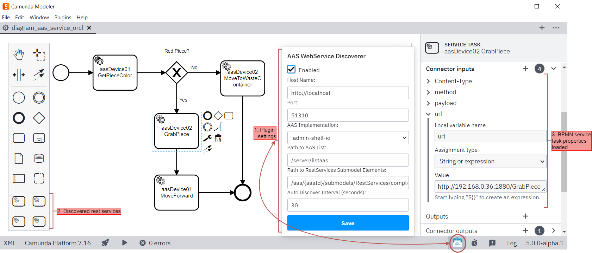

# Asset Administration Shell-Based Business Process Modeler (AASBPM)

 [](#) [](#)

This solution enables camunda modeler to discover REST services from a desired Asset Administration Shell (AAS) repository. It iterates the AASs found in the repository and gets all submodelElements which submodel idShort is "RestServices". Each submodelElement represents an individual service of the asset. This solution aims to assist business analysts on the design manufacturing business processes by providing a Service-Discovery mechanism from the AAS repository.

## Full architecture of our proposal


## Screenshot of Camunda Modeler and the AAS Service Discoverer plugin


## Important resources
The "RestServices" Submodel template can be found at \aasResources\submodelTemplate

The generic form for the package explorer is at \aasResources\packageExplorerGenericForm

And some example aasxs that implements the WebServices submodel are at \aasResources\aasxs


## Compatibility
Right now this plugin has been tested with Camunda Modeler version 5 and the AASX Server from admin.shell.io: https://github.com/admin-shell-io/aasx-server

We are currently developing to make it compatible with the Basyx AAS implementation.

## Development Setup

Use [npm](https://www.npmjs.com/), the [Node.js](https://nodejs.org/en/) package manager to download and install required dependencies:

```sh
npm install
```

To make the Camunda Modeler aware of your plugin you must place the entire project (without node_modules) into the Camunda's Modeler plugin folder (C:\camunda-modeler\resources\plugins). For reference, see this: [Camunda Modeler plugin directory](https://github.com/camunda/camunda-modeler/tree/develop/docs/plugins#plugging-into-the-camunda-modeler). Re-start the app in order to recognize the newly linked plugin.


## Building the Plugin

Just execute this in the terminal:
```sh
npm run build
```

You may spawn the development setup to watch source files and re-build the client plugin on changes:

```sh
npm run dev
```

Given you've setup and linked your plugin [as explained above](#development-setup), you should be able to reload the modeler to pick up plugin changes. To do so, open the app's built in development toos via `F12`. Then, within the development tools press the reload shortcuts `CTRL + R` or `CMD + R` to reload the app.

## Additional Resources

* [List of existing official plugins](https://github.com/camunda/camunda-modeler-plugins)
* [Camunda official plugins documentation](https://docs.camunda.io/docs/components/modeler/desktop-modeler/plugins/)


## Licence

Apache-2.0 license
